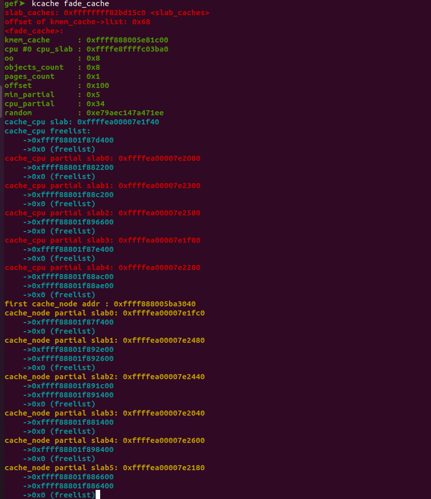

### 文档说明
由于原作者已经不再更新，在对 slub 分配器进行调试时，发现一些功能无法正常使用，因此对部分代码进行了改写，使其支持最新版本的内核（6.2.11）

dill 是一个用于linux kernel调试的gdb 插件，基于gdb 的python api开发。

主要功能包括如下：

（1）kbase 获取当前的内核基址：  


（2） kstruct 得到特定的数据结构，对于结构中存在struct和union类型的，进行递归解析，展开整个结构：


以及某个字段在数据结构中的偏移：


（3）ktask 获取某个进程的task_struct 地址 


（4）kcache 获得特定类型kmem_cache 的freelist, partial  



输出主要分成四个部分：

1. 关于kmem_cache结构的一些信息  
2. kmem_cache_cpu 上的freelist  
3. kmem_cache_cpu partial上各个page挂的freelist  
4. kmem_cache_node partial上各个page挂的freelist

以上属于插件静态解析部分，主要根据各个数据结构之间的关系进行解析  

（5）dill 跟踪某个进程的堆分配，以及释放，该部分主要是对分配和释放函数打上断点，在函数开头下断点时获取函数参数，在函数结束下断点时获取返回值，以此来获取需要的信息。


dill 模块的功能包括：  
（1）dill run ：对要跟踪的函数打上断点  
（2）dill process_name : 跟踪对应进程的堆分配和释放，会输出分配/释放的slab类型，以及堆块地址  
（3）dill on/off ：对输出日志进行开启/关闭  

各个结构之间的数据关系图：


内核管理页面使用了2个算法：伙伴算法和slub算法，伙伴算法以页为单位管理内存，但在大多数情况下，程序需要的并不是一整页，而是几个、几十个字节的小内存。于是需要另外一套系统来完成对小内存的管理，这就是slub系统。slub系统运行在伙伴系统之上，为内核提供小内存管理的功能。

通过cat /proc/slabinfo 查看系统当前可用的kmem_cache，目前我们关注一般kmalloc申请空间的类型：


每个kmem_cache结构都表示一种类型，kmem_cache->name表示cache的名称，kmem_cache->size表示cache的大小。每个cache通过kmem_cache->list.next指向下一个cache，形成一个链表。我们找到全局变量 slab_caches就能遍历该链表，找到对应的cache信息。

内存分配释放相关的结构如下：

```
kmem_cache
    - kmem_cache_cpu 
        - freelist
        - partial
    - kmem_cache_node
        - partial
```

#### kmem_cache_cpu freelist

freelist成员指向第一个可用内存obj首地址。类似fastbin，在开头保存下一个obj的地址，采用 FIFO 进行分配和回收

#### kmem_cache_cpu partial

kmem_cache_cpu->partial指向的是一个page，每个page通过page->next链接，形成链表，而每个page下都挂着一个freelist，如果kmem_cache_cpu freelist 上的空闲obj分配完就会从这分配。

#### kmem_cache_node partial

kmem_cache_node->partial指向的也是一个page，但每个page是通过page->lru链接，其他和kmem_cache_cpu partial类似。值得注意的是node中的slab是所有cpu共享的，而per cpu是每个cpu独占的。

#### kmem_cache_node full

kmem_cache_node->full 指向的是自身的地址，full slab没有链表来管理，只有full变成partial才会被接入partial链中。

总结：

kmalloc分配内存顺序如下：kmem_cache_cpu freelist -> kmem_cache_cpu partial -> pkmem_cache_node partial

如果前一个没有空闲的object，依次找下一个。

目前实验环境下插件可以正常运行，但跟踪复杂程序时，在释放的地方下断点容易崩，后面再慢慢完善。

### 参考链接

https://github.com/PaoloMonti42/salt/tree/master/docs  
https://sourceware.org/gdb/onlinedocs/gdb/Python-API.html  
https://www.anquanke.com/post/id/200161  
https://my.oschina.net/fileoptions/blog/1630346  

